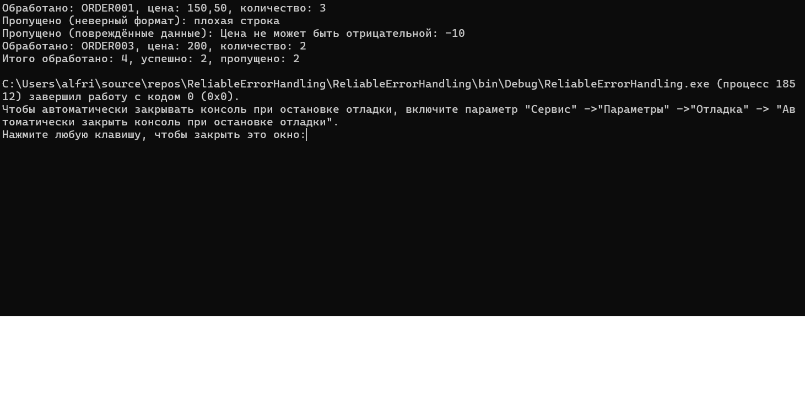

# Задание «Контрольная точка №9 — надёжная обработка ошибок в реальных сценариях»

# Вариант 1. OrderProcessor (обработка заказов)

Входные строки в формате "ID;цена;количество", например "ORDER001;150.50;3".

1. Парсите цена (decimal) и количество (int) через TryParse. Если строка не парсится целиком (неверный формат, нехватка частей после разделения по ;) — залогируйте предупреждение и переходите к следующей строке без исключений.

2. Спроектируйте OrderProcessingException (наследник Exception, три стандартных конструктора) и бросайте его, если цена успешно распарсилась, но оказалась отрицательной — это считается повреждёнными данными, а не опечаткой.

3. Поймайте OrderProcessingException с фильтром catch (OrderProcessingException ex) when (ex.Message.Contains("цена")), залогируйте и продолжите обработку остальных строк.В finally выведите сводку: количество обработанных, успешных и пропущенных заказов.

# Результаты и проверочные ключи

Для Варианта 1 (OrderProcessor), на входе ["ORDER001;150.50;3", "плохая строка", "ORDER002;-10;1", "ORDER003;200;2"]:

| Строка | Ожидаемое поведение |
|---|---|
| `ORDER001;150.50;3` | обработан успешно |
| `плохая строка` | пропущен, предупреждение о формате, без исключения |
| `ORDER002;-10;1` | OrderProcessingException, пойман через `when`, пропущен |
| `ORDER003;200;2` | обработан успешно |
| итог | Обработано: 4, успешно: 2, пропущено: 2 |

# Результат

